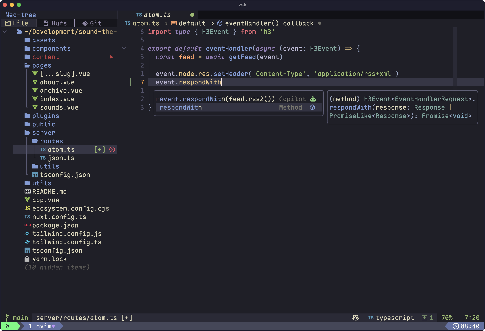

# My dotfiles

I [use stow](https://brandon.invergo.net/news/2012-05-26-using-gnu-stow-to-manage-your-dotfiles.html) to manage my dotfiles.

## NeoVim

🌟 Started from [Launch.nvim](https://github.com/LunarVim/Launch.nvim) 🌟

* [simctl.nvim](https://github.com/terje/simctl.nvim) for iOS Simulator control
* [Kanagawa](https://github.com/rebelot/kanagawa.nvim) color scheme
* [Neo-tree](https://github.com/nvim-neo-tree/neo-tree.nvim) file browser with Git status indicators
* [Oil](https://github.com/stevearc/oil.nvim) for Vim-style editing of file system
* Styled status line from lualine with system status, git status, file type, file path and cursor location
* Cmp styling
* [WhichKey](https://github.com/folke/which-key.nvim) keybinding help
* GitHub Copilot with cmp-integration and ChatGPT clients
* Conform autoformatting
* Smooth scrolling from [Neoscroll](https://github.com/karb94/neoscroll.nvim)
* Integration with tmux through [Vimux](https://github.com/preservim/vimux)
* Built-in terminal from [toggleterm.nvim](Terminal toggle)
* LazyGit

Neovim running in a [Kitty](https://sw.kovidgoyal.net/kitty/) terminal on Mac OS using the [JetBrains Mono](https://www.nerdfonts.com/font-downloads) patched nerd font.

